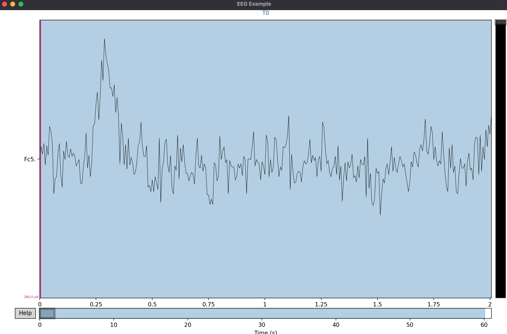
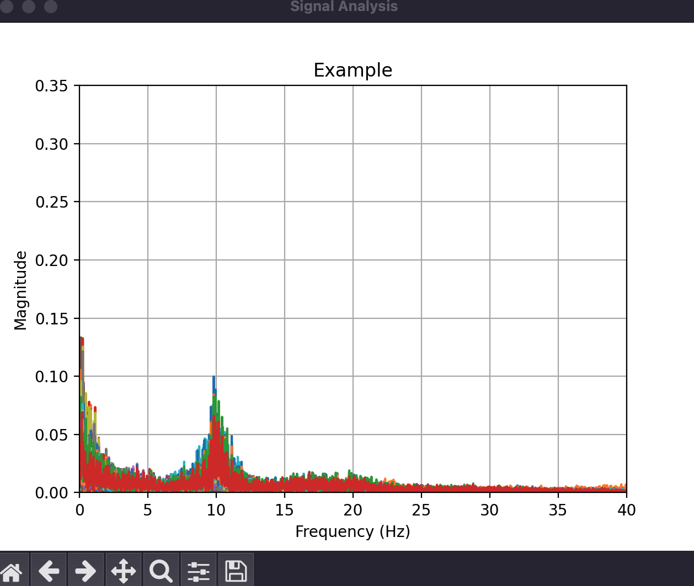

# total-perspective-vortex
This project is about building a pipeline to handle eeg data.

## eeg data
An **electroencephalogram** is a medical record of the electrical brain activity as signals.  
A classic setup of *eeg data* acquisition is by putting electrodes on living being head and then record the cerebral activity.  
These datas can be useful for research.  
In our case we want to determine when does the user do a movemement or think of doing a movement (like opening right hand and thinking of doing it).  

> [!NOTE]
> It will be binary classification A or B.  

### electrical signals
The signal obtained by the *eeg setup* will be a electrical signal that can be represented like that :  

This is the representation of the signal obtained by a unique electrode.  In our case we use 64 distincts electrodes.  
Because the data is a recording, we will need to split the recording every $x$ ms to have an usable data.  

#### filtering
For the moment each signal is still unusable. Like every other ML/Deep learning project, we have to filter our data to keep only the one that is essential for us.

As you know we are actually dealing with signals which is a little bit different than handling classic "excel" like dataset. To imagine how we can filter signal you'll have to look a little on how is composed a signal.  

A signal is **composed of multiples frequencies**, but when we read the dataset we have everything inside this signal. Our goal is to uncomposed our signal to look where are located the frequencies and remove the over ones to only keep the *"useful" data*.  

To achieve this you can display the decomposition of your signal using Fourier Transform (**please have a look at the links below**).  
*Fourier Transform algorithm* will give us a function that will take a frequency as an **input an return a amplitude as an output**.
When the amplitude is *high, it means that there is a frequency* that compose the signal and when amplitude is small or close to zero. It means that, *there is no frequency* from the signal.  

I'll explain it with a scheme :  
   
As you can see there, there are some data in our signal starting from 0 to 25 frequencies, with two peaks at 0Hz and 10Hz. But then after 25-30Hz there is no more interesting data.  

> [!NOTE]
> We actually use Discrete Fourier Transform because our signal isn't continuous but discrete.  
> Integrals won't works.

> [!TIP]
> Fast Fourier Transform (-> numpy.fft) is well optimized version of the algorithm.  

So, after different analysis of different case we can deduce that we only the frequencies from 0 to 30Hz.  

### dimensionality reduction algorithm
Since we have filtered our data we can think that we are ready for our classification algorithm!  
But not already, as you might notice we have reduce the number of frequencies but we still have 64 different electrodes.  

> [!TIP]
> The number of feature of this dataset is high, cause features = number of electrodes * number of frequencies.

To reduce the number of channels (electrodes) that we will use. We have to look if some of them are correlated or linked.  
Meaning that if the feature $\alpha$ is growing/decreasing and the feature $\beta$ do the same. We might think of just keeping one of them to reduce useless calculations since they do the same.  

This is the general idea.   
You could also think of representing a 3D dataset (since we can't go to higher dimension 'visually') inside of a cube. You will have all of the points representing the dataset and the goal is to place yourself where you can have in a "picture" the best representation of the dataset.  

To achieve this concept there are multiples methods as written in the subject, the most adapted to our case is using CSP (*Common Spacial Pattern*).  

#### common spacial pattern (CSP)
Before looking at the formula, we'll need to break down some basis:
- variance: a measure of how far a set of numbers is spread out from their average value
- covariance: a measure that analyse how to variable vary together, indicating whenether they increasing/decreasing in sync
- eigenvector: a vector that is scaled by a certain value but stay in the same direction
- eigenvalue: the value which scale the eigenvector

> [!IMPORTANT]
> In some case there are some human interpretation to consider depending the thematics and the concerned features.  

# To look
- What is EEG data ?
    1. Display data with MNE package
- Dimensionality Reduction Algorithm ?
- "real time" data stream
- look for scipy

1. Implementer Preprocessing avec PCA, ICA..
2. Classicification
3. Running

## Links
- [DataSet](https://physionet.org/static/published-projects/eegmmidb/eeg-motor-movementimagery-dataset-1.0.0.zip)
- [MNE Package](https://mne.tools/stable/index.html)
- [eeg data processing](https://www.youtube.com/watch?v=B9ti7boa9jc)
- [Fourier Transform](https://www.youtube.com/watch?v=spUNpyF58BY)
- [Complex Numbers](https://www.youtube.com/watch?v=M6o5CRYfNxA)
- [Linear Algebra & Vectors (&matrix by the way)](https://www.youtube.com/watch?v=fNk_zzaMoSs&list=PLZHQObOWTQDPD3MizzM2xVFitgF8hE_ab)
- [Variance](https://fr.wikipedia.org/wiki/Variance_(math%C3%A9matiques))
- [CoVariance](https://fr.wikipedia.org/wiki/Covariance)
- [Principal Component Analysis (PCA)](https://www.youtube.com/watch?v=FD4DeN81ODY)
